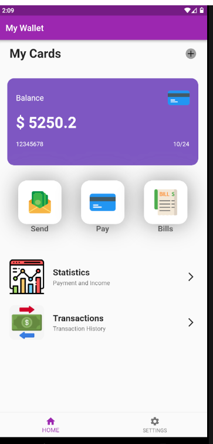
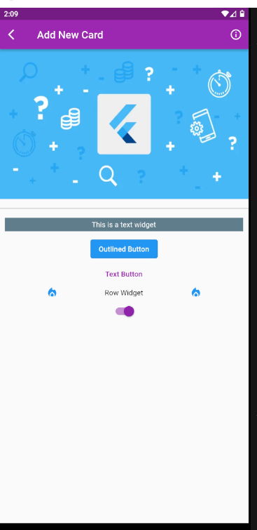
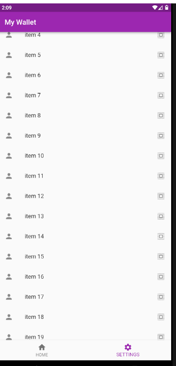

# Wallet Simple Demo 
This is a simple Flutter frontend mobile application and my first experience to learn and code with Flutter Framework by implementing flutter simple UI

## Languages
Dart - Flutter(framework)
## Source
| Landing | Nested Stack | Settings |
| ------- | ------------ | -------- |
|| ||

## Installation
visit './src' and follow README.md shown instructions
